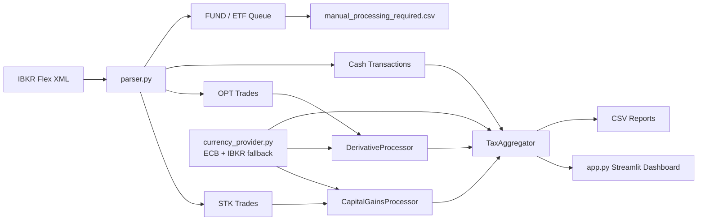

# Austrian Tax Engine for IBKR

> A high-end Streamlit tax dashboard for Austrian capital gains tax reporting from Interactive Brokers Flex Query XML files.

[](https://www.python.org/)
[](https://streamlit.io/)
[](#austrian-e1kv-field-mapping)
[](#important-disclaimer)

## Overview

This project turns an IBKR Flex Query XML export into a structured Austrian **E1kv** capital income report. It separates stocks, derivatives, dividends, interest, foreign withholding tax, and ETF/FUND rows, then renders the results in a dark, neon-accented Streamlit dashboard.

The core engine is built around Austrian private-investor tax concepts:

- **Stocks:** moving average cost basis, or `Gleitender Durchschnittspreis`
- **Options and derivatives:** realized premium and close-out P/L
- **Dividends and interest:** gross income tracking
- **Foreign withholding tax:** creditable tax bucket for E1kv field 998
- **Loss offsetting:** internal offset inside the 27.5% capital income basket
- **ETF/FUND detection:** automatic manual-processing queue

## Visual Identity

The interface uses a dark FinTech theme:

| Category | Accent | E1kv Field |
| --- | --- | --- |
| Stocks | Neon Blue `#00D4FF` | 861 |
| Derivatives / Options | Neon Purple `#BB86FC` | 775 |
| Dividends / Interest | Emerald Green `#00FF88` | 862, 777/863 |
| ETFs / Funds | Amber Gold `#FFD700` | Manual review |
| Tax Due | Signal Red `#FF4D6D` | Calculated liability |

## Austrian E1kv Field Mapping

| E1kv Field | Meaning | Engine Source |
| --- | --- | --- |
| **861** | Realized stock gains taxable at 27.5% | `assetCategory="STK"` moving-average realization |
| **775** | Income from derivatives and options | `assetCategory="OPT"` and related derivative categories |
| **862** | Dividends | IBKR cash dividend transactions |
| **777 / 863** | Foreign interest income | IBKR cash interest transactions |
| **998** | Creditable foreign withholding tax | withholding-tax cash rows |

## Architecture



## Project Structure

```text
tax_calculator_v7/
├── app.py                         # Streamlit entry point and dashboard
├── currency_provider.py           # ECB FX provider with local cache
├── parser.py                      # IBKR Flex XML categorization
├── tax_engine.py                  # Austrian tax calculation engine
├── styles.py                      # Dark FinTech CSS
├── sample_flex.xml                # Demonstration Flex XML
├── smoke_test.py                  # Minimal engine verification
└── requirements.txt               # Runtime dependencies
```

## Quick Start

Create and activate a virtual environment, then install dependencies:

```powershell
python -m venv venv
.\venv\Scripts\Activate.ps1
python -m pip install -r requirements.txt
```

Run the dashboard:

```powershell
python -m streamlit run app.py
```

Then open the local Streamlit URL shown in the terminal.

## Using the Dashboard

1. Export an **IBKR Flex Query XML** file from Interactive Brokers.
2. Start the Streamlit app.
3. Upload the XML file in the sidebar.
4. Review the **Executive Summary** for:
   - profit/loss per tax category
   - total KESt liability
   - E1kv field mapping
   - ETF/FUND manual-processing warnings
5. Switch to **Detailed Audit Trail** for:
   - trade-level EUR conversion
   - ECB or fallback FX source
   - buy/sell timing
   - cost basis evolution
   - realized P/L per transaction

## Exported Reports

The application can generate:

| File | Purpose |
| --- | --- |
| `E1kv_Report_2026.csv` | Direct E1kv field summary |
| `transaction_audit.csv` | Trade-by-trade calculation log |
| `manual_processing_required.csv` | ETF/FUND rows requiring separate Austrian fund-tax review |

## Calculation Highlights

### Moving Average Stock Cost

For stock purchases, the engine updates the Austrian average cost basis:

```text
NewAvgCost =
    (OldTotalCost_EUR + NewPurchaseQty * Price_EUR + Commission_EUR)
    / (OldQty + NewQty)
```

For stock sales, realized P/L is calculated from sale proceeds less the moving-average cost basis.

### FX Conversion

All non-EUR amounts are converted into EUR using:

1. ECB reference rates for the relevant trade date when available.
2. The nearest prior ECB business day when needed.
3. IBKR `fxRateToBase` as an offline fallback.

### Loss Offsetting

The aggregator offsets gains and losses inside the Austrian 27.5% capital-income basket before calculating tax due. Foreign withholding tax is tracked separately as a creditable amount.

## Smoke Test

Run the included verification script:

```powershell
python smoke_test.py
```

Expected output:

```text
smoke test passed
```

## Important Disclaimer

This software is a technical calculation aid, not official tax advice. Austrian capital income taxation can depend on broker data quality, investor status, fund reporting, treaty limits, account structure, and yearly FinanzOnline rules. Review results carefully and consult a qualified Austrian tax professional before filing.

## Roadmap

- Historical ECB archive backfill beyond the current cache window
- Full option lifecycle reconstruction for complex multi-leg strategies
- OeKB fund-report integration for Austrian ETF taxation
- PDF report generation for advisor handoff
- Automated validation against known IBKR Flex Query variants

