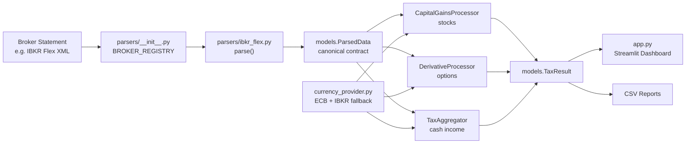

# Austrian KeSt Tax Engine

> A modular, animated Streamlit tax dashboard for Austrian capital gains tax reporting. Supports IBKR Flex Query XML today; adding a new broker requires one file and two lines.

[](https://www.python.org/)
[](https://streamlit.io/)
[](#austrian-e1kv-field-mapping)
[](#important-disclaimer)

## Overview

Turns a brokerage statement export into a structured Austrian **E1kv** capital income report. Separates stocks, derivatives, dividends, interest, foreign withholding tax, and ETF/FUND rows, then renders the results in a dark neon-accented Streamlit dashboard with smooth entrance animations.

The core engine is built around Austrian private-investor tax concepts:

- **Stocks:** moving average cost basis (`Gleitender Durchschnittspreis`)
- **Options and derivatives:** realized premium and close-out P/L, open vs close correctly separated
- **Dividends and interest:** gross income tracking
- **Foreign withholding tax:** creditable tax bucket for E1kv field 998
- **Loss offsetting:** internal offset inside the 27.5% capital income basket
- **ETF/FUND and unknown asset detection:** automatic manual-processing queue

## Visual Identity

Dark FinTech theme with animated metric cards, staggered entrance animations, hover lift + shimmer effects, and a persistent pulse glow on the KeSt Due card:

| Category | Accent | E1kv Field |
| --- | --- | --- |
| Stocks | Neon Blue `#00D4FF` | 861 |
| Derivatives / Options | Neon Purple `#BB86FC` | 775 |
| Dividends / Interest | Emerald Green `#00FF88` | 862, 777/863 |
| ETFs / Funds | Amber Gold `#FFD700` | Manual review |
| Tax Due | Signal Red `#FF4D6D` | Calculated liability |

## Austrian E1kv Field Mapping

| E1kv Field | Meaning | Engine Source |
| --- | --- | --- |
| **861** | Realized stock gains taxable at 27.5% | `assetCategory="STK"` moving-average realization |
| **775** | Income from derivatives and options | `assetCategory="OPT"` and related derivative categories |
| **862** | Dividends | Cash dividend transactions |
| **863** | Foreign interest income | Cash interest transactions (IBKR is a foreign broker) |
| **998** | Creditable foreign withholding tax | Withholding-tax cash rows |

## Architecture

The parser layer is the only broker-specific code. Everything below the `ParsedData` boundary is broker-agnostic.



## Project Structure

```text
tax_calculator_v7/
├── app.py                         # Streamlit entry point; session_state caching; three-view navigation
├── models.py                      # Shared contracts: ParsedData, TaxResult, column schemas
├── tax_engine.py                  # Austrian KeSt calculation engine (broker-agnostic)
├── currency_provider.py           # ECB FX provider with local JSON cache
├── styles.py                      # Animated dark FinTech CSS
├── parsers/
│   ├── __init__.py                # Broker registry: BROKER_REGISTRY, get_parser()
│   └── ibkr_flex.py               # IBKR Flex XML → ParsedData
├── sample_flex.xml                # Demonstration Flex XML (stock buy+sell, option, fund, dividends)
├── smoke_test.py                  # Engine verification with structural and value assertions
└── requirements.txt               # Runtime dependencies
```

## Quick Start

```powershell
python -m venv venv
.\venv\Scripts\Activate.ps1
python -m pip install -r requirements.txt
python -m streamlit run app.py
```

Then open the local URL shown in the terminal.

## Using the Dashboard

1. Select your **Broker** in the sidebar (currently: IBKR Flex XML).
2. Upload the corresponding statement file. To explore without a real file, enable **Use embedded sample** — a blue banner appears to remind you that demo data is active.
3. Review the **Executive Summary** for:
   - Six metric cards in a 3×2 grid — hover any card for a plain-language explanation and the BMF source; expand **E1kv Field References** for clickable links to the legal texts.
   - KeSt calculation breakdown (taxable basket → gross KeSt → credit → net due), each step with a tooltip.
   - E1kv field mapping table and category P/L chart.
   - ETF/FUND and unknown-category manual-processing warnings.
4. Switch to **Detailed Audit Trail** for:
   - Trade-level EUR conversion with ECB or fallback FX source.
   - Buy/sell timing, cost basis evolution, and realized P/L per line.
5. Switch to **Performance** for:
   - Cumulative realized P/L timeline (stocks + derivatives only, interactive zoom/pan).
   - Monthly breakdown of gains, fees, and estimated KeSt.
   - Top holdings ranked by total P/L.

The **Include fees in tax basis** toggle (default OFF) controls whether brokerage commissions are factored into taxable gain calculations — see [Fee Deductibility](#fee-deductibility-toggle) below.

All sidebar controls carry hover tooltips explaining their purpose.

## Adding a New Broker

1. Create `parsers/<broker_slug>.py` exposing `parse(source: str | Path | bytes) -> ParsedData`.
2. Map your broker's fields to the column schemas defined in `models.TRADE_COLUMNS` and `models.CASH_COLUMNS`.
3. Add one entry each to `BROKER_REGISTRY` and `BROKER_SAMPLES` in `parsers/__init__.py`.

The tax engine and UI require zero changes.

## Exported Reports

| File | Purpose |
| --- | --- |
| `E1kv_Report_2026.csv` | Direct E1kv field summary |
| `transaction_audit.csv` | Trade-by-trade calculation log with FX details |
| `manual_processing_required.csv` | ETF/FUND and unrecognised-category rows requiring manual review |

## Fee Deductibility Toggle

Austrian private income tax law (**§ 20 Abs. 2 EStG**) prohibits the deduction of brokerage fees and transaction costs when calculating taxable capital gains for private investors. The engine enforces this by default.

| Toggle state | Behaviour | When to use |
| --- | --- | --- |
| **OFF** (default) | Commissions are excluded from the taxable gain calculation | Austrian private accounts — strictly correct under § 20 Abs. 2 EStG |
| **ON** | Commissions are included in cost basis and proceeds | Business accounts or non-Austrian jurisdictions |

Regardless of the toggle, the **actual fee amount paid** is always recorded in the `commission_eur` column of the Detailed Audit Trail, so you always have a complete record of what your broker charged.

> **Technical detail for derivatives:** IBKR's `fifoPnlRealized` field already embeds the closing-leg commission in its net P/L figure. When fees are excluded, the engine strips the closing commission back out. The opening-leg commission is implicitly part of the IBKR cost basis and cannot be separated without full leg reconstruction — amounts involved are typically < €2 per contract.

## Calculation Highlights

### Moving Average Stock Cost

```text
# Fees excluded (default — Austrian § 20 Abs. 2 EStG):
NewAvgCost = (OldTotalCost_EUR + NewQty × Price_EUR) / (OldQty + NewQty)

# Fees included (business / non-Austrian mode):
NewAvgCost = (OldTotalCost_EUR + NewQty × Price_EUR + Commission_EUR) / (OldQty + NewQty)
```

Sales realize P/L against the running moving-average cost basis.

### Derivative P/L (Open vs Close)

Opening trades contribute zero realized P/L. Closing trades use `fifoPnlRealized` from the broker, with `proceeds + commission` as a fallback only when the broker omits it on a closing leg.

### FX Conversion

All non-EUR amounts are converted using:

1. ECB reference rates for the exact trade date.
2. Nearest prior ECB business day when the exact date is unavailable.
3. IBKR `fxRateToBase` as an offline fallback.
4. `1.0` with a `"Missing FX rate fallback"` source tag — never crashes.

### KeSt Calculation

```text
basket_income = stock_P/L + option_P/L + dividends + interest
taxable_base  = max(0, basket_income)          ← internal loss offset
gross_kest    = taxable_base × 0.275
kest_due      = max(0, gross_kest − foreign_tax_credit)
```

Loss offsetting happens within the 27.5% basket only. Foreign withholding tax is tracked separately as a creditable amount (field 998).

## Smoke Test

```powershell
python smoke_test.py
# smoke test passed
```

Checks structure, directional values (stock gains > 0, option income > 0, tax due > 0), and a regression guard ensuring opening derivative trades never contribute non-zero realized P/L.

## Important Disclaimer

This software is a technical calculation aid, not official tax advice. Austrian capital income taxation can depend on broker data quality, investor status, fund reporting, treaty limits, account structure, and yearly FinanzOnline rules. Review results carefully and consult a qualified Austrian tax professional before filing.

## Roadmap

- Unit test suite for `CapitalGainsProcessor`, `DerivativeProcessor`, and KeSt formula
- Historical ECB archive backfill beyond the 90-day cache window
- Full option lifecycle reconstruction for complex multi-leg strategies
- OeKB fund-report integration for Austrian ETF taxation
- PDF report generation for advisor handoff
- Additional broker parsers (Degiro CSV, Flatex, Scalable Capital)
